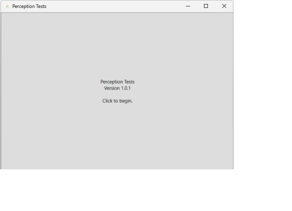
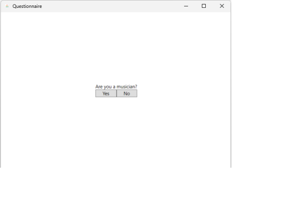
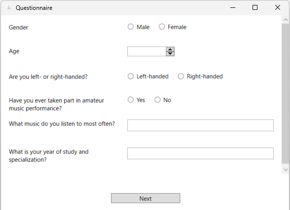
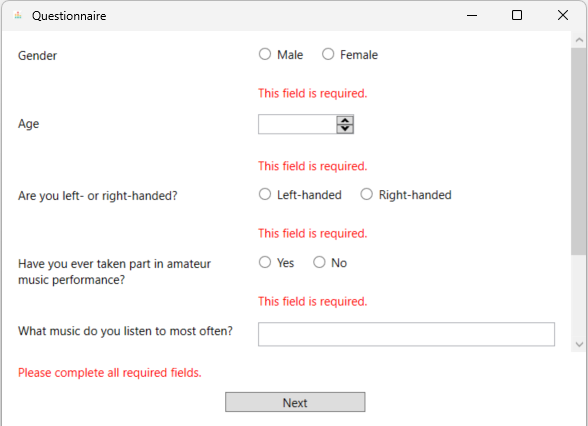
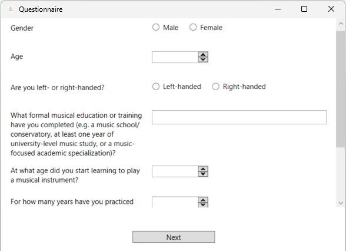
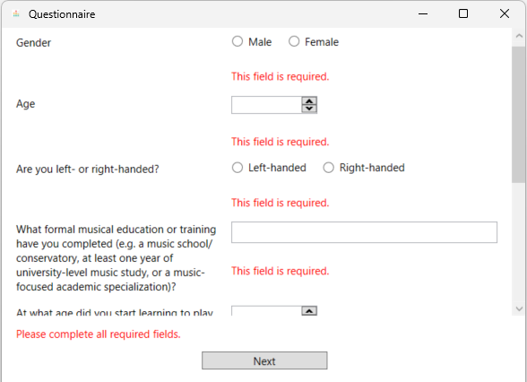
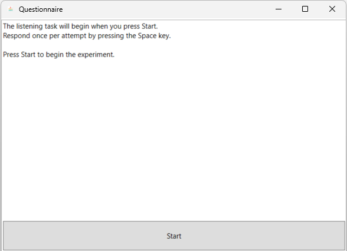
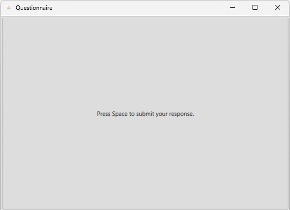
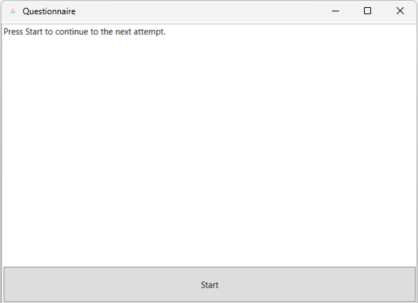
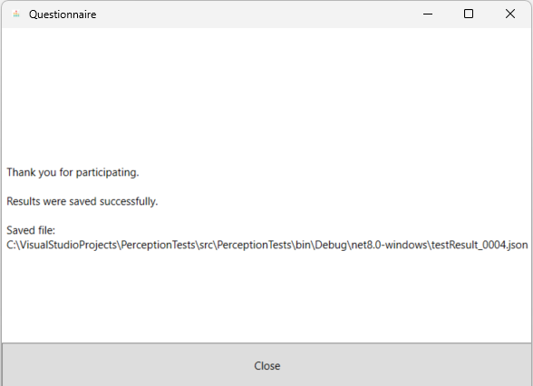

# UI Screenshots

This document provides an overview of the **PerceptionTests** user interface. The screenshots are organized according to the participant workflow.

## Workflow Overview

| Stage | Screenshot | Description |
| --- | --- | --- |
| Welcome |  | Initial application screen introducing the experiment and prompting the participant to begin. |
| Participant group selection |  | Branching screen asking whether the participant is a musician. |

## Questionnaire Screens

| Participant group | Questionnaire form | Validation state |
| --- | --- | --- |
| Non-musician participant |  |  |
| Musician participant |  |  |

The questionnaire screens demonstrate both participant branches and the required-field validation behavior used before advancing to the listening task.

## Listening Session Workflow

| Stage | Screenshot | Description |
| --- | --- | --- |
| Session instructions |  | Pre-session instruction screen explaining that playback begins after pressing Start and that the participant should respond with the Space key. |
| Response capture |  | In-session response screen shown during playback, prompting the participant to press Space to submit a response. |
| Next attempt transition |  | Inter-attempt transition screen prompting the participant to continue to the next attempt. |
| Completion and save |  | Final screen confirming participation and successful result export, including the save path. |
